# Arctic Fox VS Code Theme

Arctic Fox is a modern and readability-focused Visual Studio Code theme offering a wide variety of color schemes. It provides a clean and balanced look, reducing eye strain while coding.

## Features
- **Arctic Fox Dark**: Dark background with pastel and balanced colors
- **Arctic Fox Light**: Light background with soft and contrasting tones
- **Additional Themes**: Includes a variety of themes such as Dracula, Monokai Pro, Solarized Dark/Light, Tokyo Night, and more (20 themes in total).
- Advanced language support (JS, TS, Python, Rust, C#, Markdown, etc.)
- Modern and minimal design
- Colors that highlight your code without distractions
- Optimized highlights for symbols, keywords, and variables

## Installation

1. Go to the VS Marketplace.
2. Click the "Install" button.
3. Select a theme. Arctic Fox offers multiple options:
   - Arctic Fox Dark
   - Arctic Fox Light
   - Dracula
   - Monokai Pro
   - Solarized Dark
   - Solarized Light
   - Tokyo Night
   - Night Owl
   - One Dark Pro
   - Synthwave 84
   - Palenight
   - GitHub Dark
   - GitHub Light
   - Dark Lime Flat
   - Dark Orange
   - Dark Orange Flat
   - Dark Purple Flat
   - Dark Yellow Flat
   - Orange
   - Template Flat

## Theme Previews

Below are previews of some of the themes included:

### Arctic Fox Dark
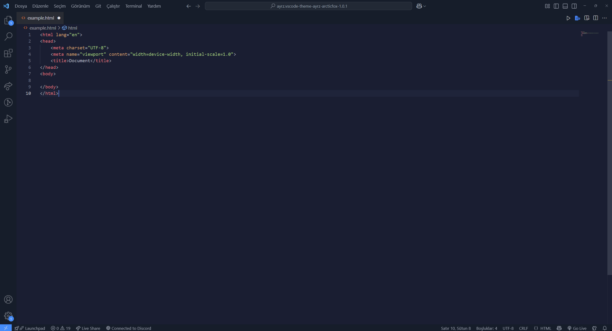

### Arctic Fox Light
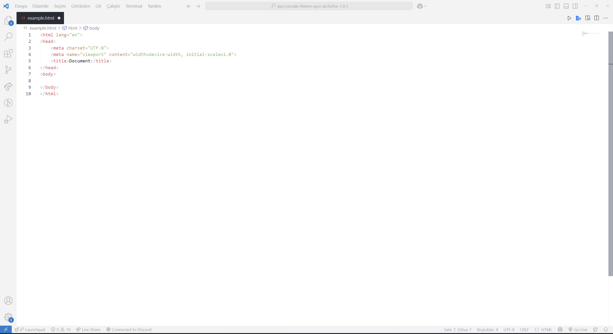

### Dracula
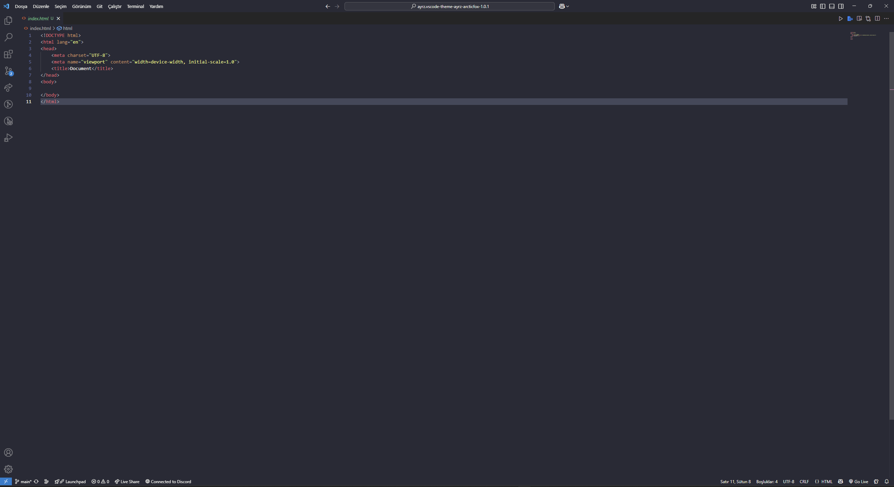

### Monokai Pro
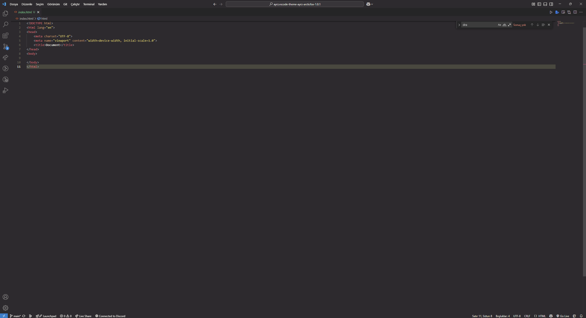

### Solarized Dark
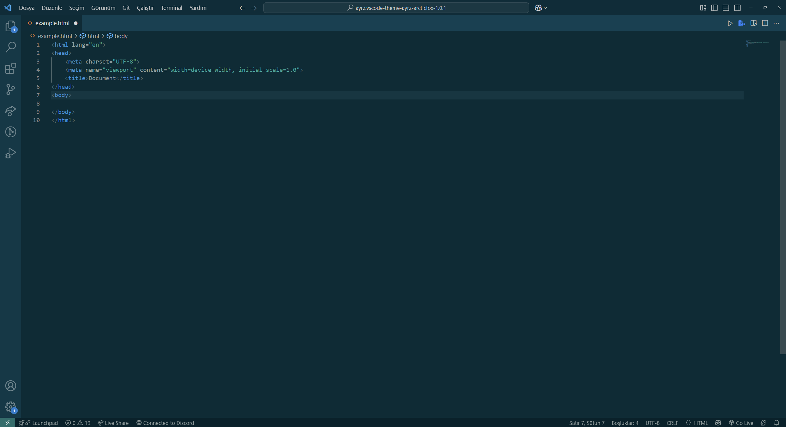

### Solarized Light
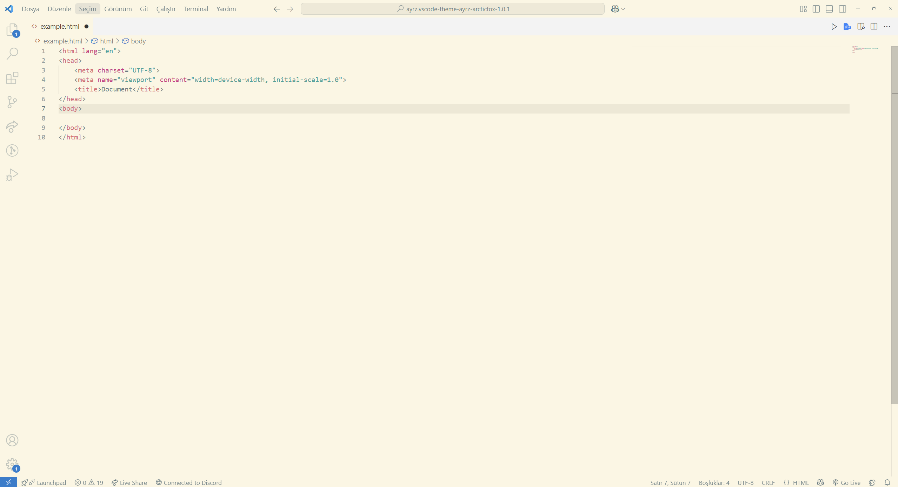

### Tokyo Night
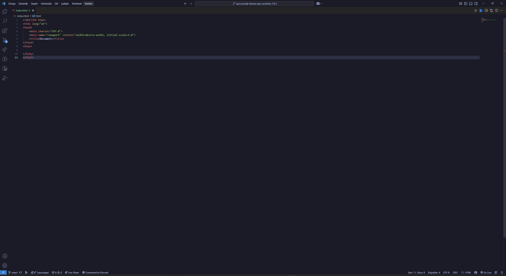

### Night Owl
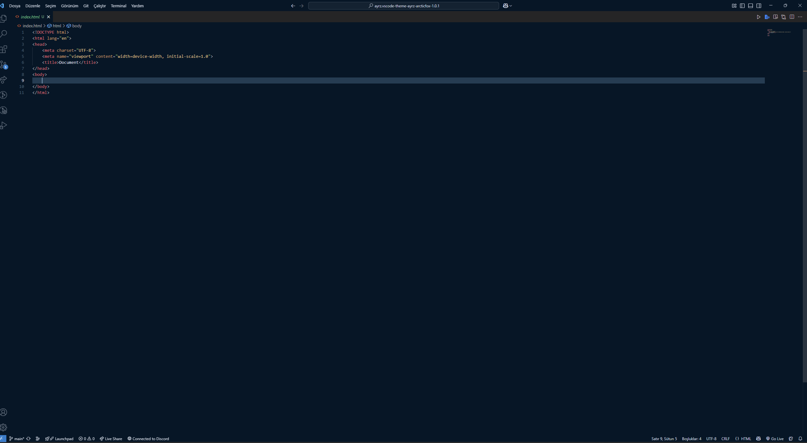

### One Dark Pro
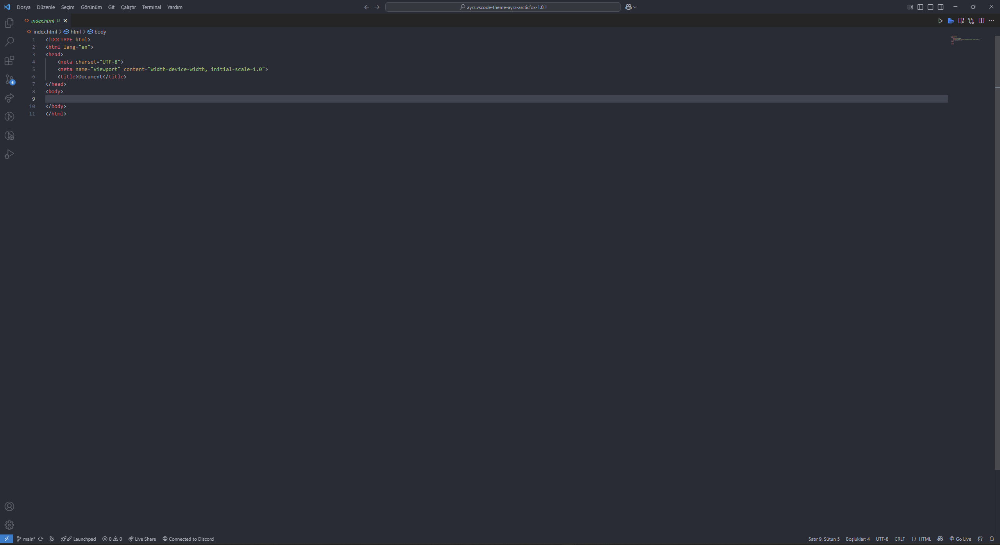

### Synthwave 84
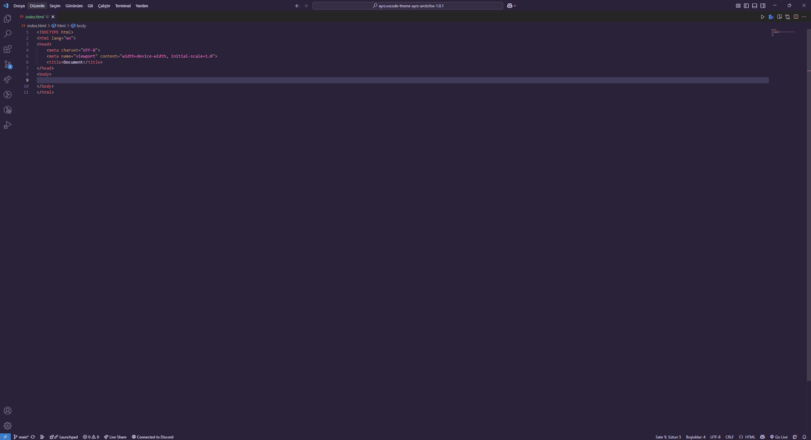

### Palenight
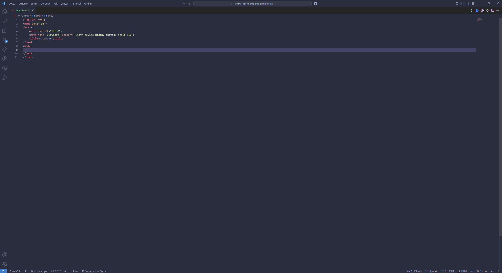

### GitHub Dark
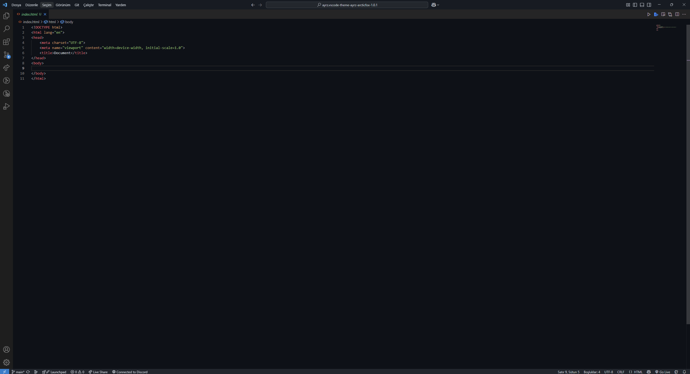

### GitHub Light
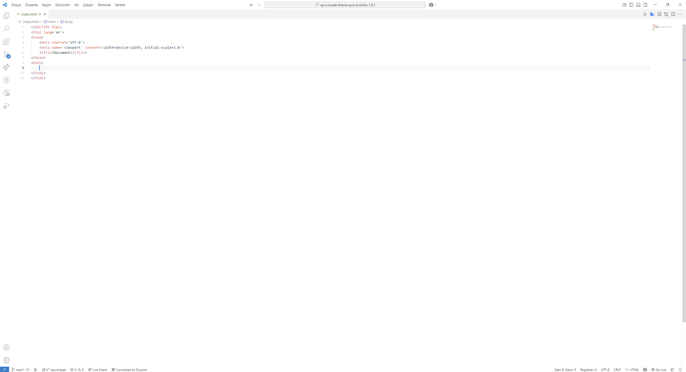

### Dark Lime Flat
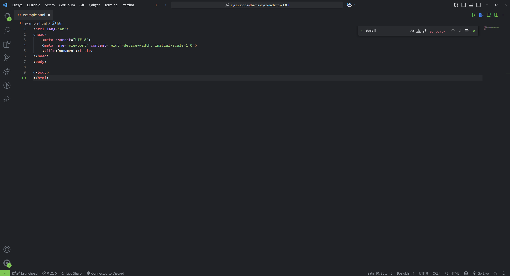

### Dark Orange
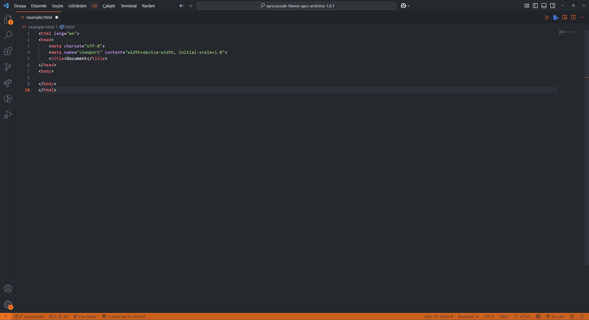

### Dark Orange Flat
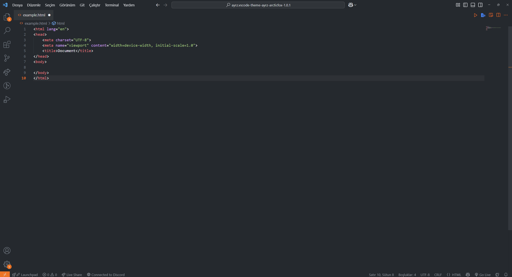

### Dark Purple Flat
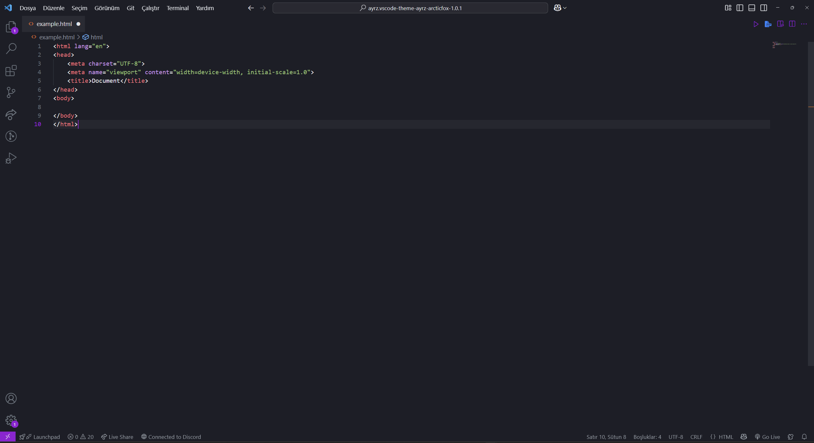

### Dark Yellow Flat
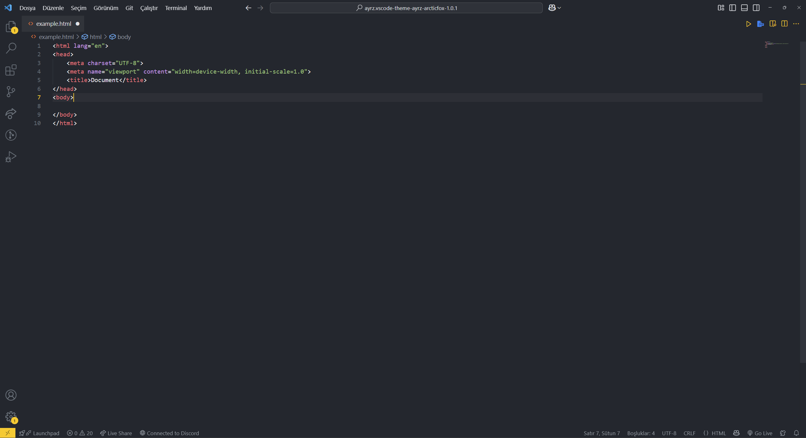

### Orange

### Template Flat

## License
MIT

Design: **Ahmet Mücahit Doğru** (*Ayrz*)
